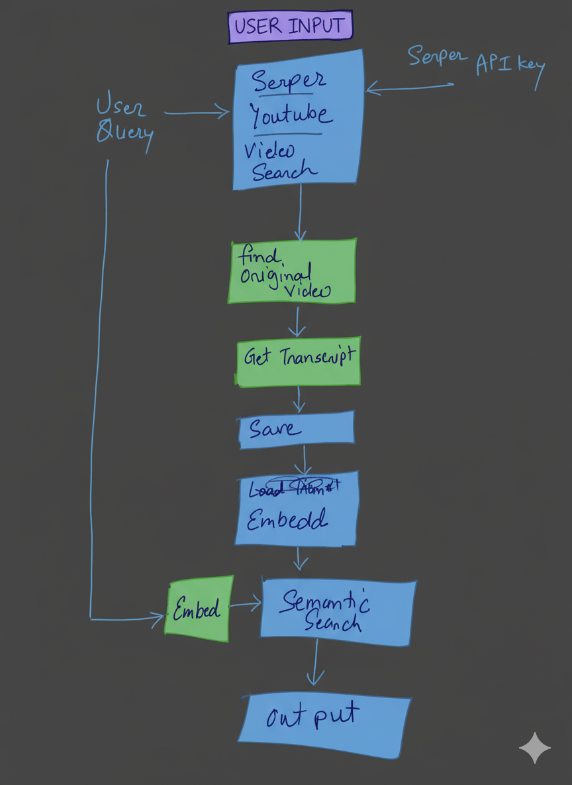

## YouTube Transcript Semantic Search Tool 🎥

A Python-based utility designed to fetch and analyze YouTube video transcripts using embeddings. It allows users to perform semantic searches on the video content and retrieve a direct link that starts playback at the exact timestamp of the matching text.

## 🚀 Project Setup

This project uses the `uv` tool for efficient dependency management and environment isolation.

### Prerequisites

1.  **Python 3.8+**
2.  **uv** (installable via `curl -LsSf https://astral.sh/uv/install.sh | sh`)
3.  **API Keys:**
      * **Serper API Key**: Required for certain web-based search or advanced features (if integrated later).
      * **OpenAI/Gemini/Other LLM Key**: Likely required for advanced features like summarization or high-quality embedding models. I have used sentence-transformers (all-MiniLM-L6-v2), if you want to use any openAI embeddings.

### Installation

1.  **Set Environment Variables:**
    Create a file named `.env` in the root directory and add your keys (or set them in your shell):

    ```
    # .env example
    SERPER_API_KEY="your_serper_api_key_here"
    OPENAI_API_KEY="your_openai_api_key_here"
    ```

2.  **Install Dependencies:**
    Run the following command to create the environment and install all necessary packages (`youtube-transcript-api`, `sentence-transformers`, `faiss-cpu`, etc.):

    ```bash
    uv sync
    ```

## 📂 Project Structure

```
.
├── transcription_db/
│   ├── UF8uR6Z6KLc_data.json  # Stores time-stamped JSON transcript data
│   └── ...
├── main.py # The main application file
└──  README.md
```
The script will launch a command-line interface, prompt you for a search query, and display the result:

```
--- YouTube Transcript Semantic Search Prototype ---

Enter your search query (e.g., 'What did they say about microservices?'):
> [Enter your search term here]

===========================================================================
🎥 VIDEO MATCH FOUND
===========================================================================
| Video ID:                 | UF8uR6Z6KLc                                   |
| Timestamp Start:          | 00:01:00                                      |
===========================================================================
| Matched Text Snippet:                                                 |
| First, we will cover the shift from monolithic to microservices       |
| architecture.                                                         |
===========================================================================

Please click the URL below to start watching on YouTube:
https://www.youtube.com/watch?v=UF8uR6Z6KLc&t=60s

===========================================================================
```


### Data Flow

